# Profile Based Job Matching Recommendation System
---

### Table of contents:

- [Introduction and Problem Statement](#Problem-Statement)
- [Datasets](#Datasets)
- [Data Dictionary](#Data-Dictionary)
- [Executive Summary](#Executive-Summary)
- [Exploratory Data Analysis](#Exploratory-Data-Analysis)
- [Recommendation System](#Recommendation-System)
- [Cost Benefit Analysis](#Cost-Benefit-Analyst)
- [Conclusion](#Conclusion)
- [Citations](#Citations)
---

## Introduction and Problem Statement

There are 6 steps to a recruitment process that may vary company to company depending on the business infrastructure. These 6 steps are preparing, sourcing, screening, selecting, hiring and onboarding.

A recruitment process takes anywhere from a few days to four months, according to LinkedIn's 2017 global survey. On average, each corporate job offer attracts 250 resumes and it takes approximately 6 seconds for a recruiter to scan a resume finding relevant qualities related to the job. Out of the 250 resumes, the typical employer will then interview 4–6 candidates for the job, and only one will be successful.1

According to recruiters from 2017 Recruiter Sentiment Study MRI Network, 63% mentioned that there aren't enough suitable candidates , 34% had difficulty finding passive talent and 23% found too many unqualified junk resumes from job boards.2 These are just some of the barriers faced to identify quality talent.

With regards to the hurdles recruiters face which born inefficiency to a hiring process, this project aims to build a recommendation system using natural language processing techniques to match skillsets between the job requirements and resumes then return the top recommended candidates.

---

## Datasets

There are 3 datasets used for this project, 1 for job posting and 2 for resumes. The data source are obtained from Kaggle.

The datasets are:
- job_post: A [Kaggle](#https://www.kaggle.com/elroyggj/indeed-dataset-data-scientistanalystengineer) dataset which comprises of Data Scientist/Analyst/Enginner job posting from Indeed.com in CSV format
- resume_1: A [Kaggle](#https://www.kaggle.com/gauravduttakiit/resume-dataset) dataset which comprises of resumes with job title and the resume details in CSV format.
- resume_2: A [Kaggle](#https://www.kaggle.com/akmalfaisal/resumeinfo) dataset which comprises of LinkedIn profile in CSV format.  
---
## Data Dictionary

#### Job Post Dataset
|Column|Dtypes|Data Description|
|---|---|---|
|JobPost_Job_id| object| Identifier for individual job post|
|JobPost_Job_Title| object| Job title (Consisting of Data Scientist, Data Analyst, Data Engineer)|
|Skill| object| Skills mentioned/requirements for the job|

#### Resume Dataset
|Column|Dtypes|Data Description|
|---|---|---|
|Resume_Job_id| object| Identifier for individual resume|
|Resume_Job_Title| object| Job title that the applicant applied|
|clean_resume| object| Clean version of the applicant's resume|

---

## Executive Summary

This is a capstone project on building a recommendation system similar to a Applicant Tracking System which involves 3 datasets **job_post.csv** , **resume_1.csv** and **resume_2.csv** which were combined into a single dataset later on from Kaggle. **job_post.csv** contains details relating to the job such as job title, ,skills, company name ,review score of company, location, job description, salary range while the combined **resume.csv** contains the role they are applying for and their resume content. All datasets does not come from the same source.

There are skills listed in a column `Skill` for most job post and those without were dropped from the dataset. `Regular expression` was used to preprocessed the column followed by vectorizing the skills using `CountVectorizer` and mapped to binary value to indicate if the skill was mentioned in the job post. The column `JobPost_Job_id` was created to better identify individual posts. Similarly, `Resume_Job_id` was created to help identify individual's resume. `Regular Expression` was use to clean the resume context and `TFIDF-Vectorizer` was used to vectorize the cleaned content.

Exploratory Data Analysis were done for both datasets, firstly to identify the top mentioned listed skillsets for **job_post** dataset followed by trying different `n-gram` to detect high frequency words in the resume. **pyLDAvis** was also applied to observe if it was possible to form possible topics using both methods of vectorization.

Users are given a choice of either using the skills listed in the requirements or top skills identified during EDA. Once the choice has been decided, both dataframe will then be filtered by the skills and multiplied using matrix multiplication returning scores of each applicant's resumes in response to individual job posts. These scores are first sorted in descending order and merged with the recommended applicants skill scores before churning out the output to the user. The results can be further finetune by inputting required skills after reviewing the initial results, this will do another filtering to the resume dataset just before the matrix multiplication to create a more bespoke list.

--

## Exploratory Data Analysis

#### Skill count in job post dataset
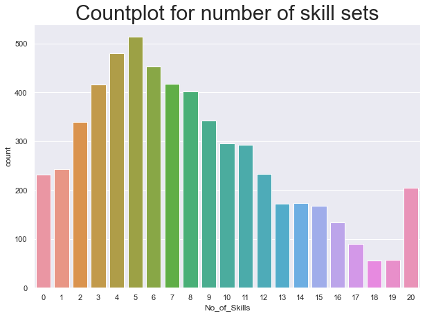

 There are several companies that does not have any skillset mentioned in their posting, they probably have adopted a different approach in their hiring process.

An example would be Google, Google uses a “scientifically proven” method called “structured interviewing”, where recruiters prepare a list of questions and a scoring rubric for each question. Every candidate answers the same set of questions for each role in a bid to standardize the interview process.

Even though these interviews are happening remotely- you will still be expected to whiteboard solutions so prepare to do that at home. Applicants interviewing for technical roles will be asked to solve technical problems in real time, such as coding a solution or whiteboarding a design. Coding questions typically done on a whiteboard are executed on a Google Chromebook for a “more authentic coding experience”. Interviewees are asked to use an interview app that lets you choose your preferred programming language.3

#### Common skills mentioned identified in job post dataset

##### Data Scientists
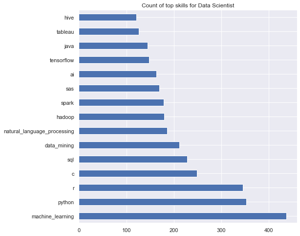

##### Data Analysts
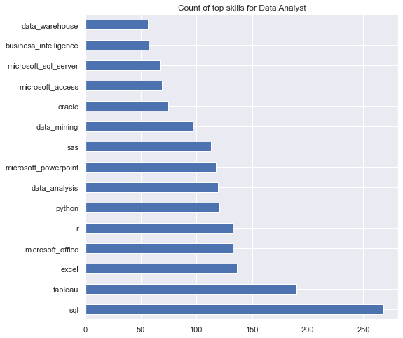

##### Data Engineer
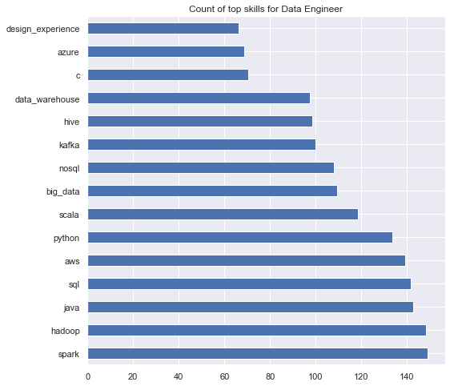

Between the 3 job titles mentioned, there are several similar skills identified between them such as SQL, python. There are also skills that seperates the 3 like for instance data scientist requires a more specialize skillset like natural language processing or machine learning which isn't mentioned in the other 2 jobs titles.

#### Top 20 words with highest frequency in resumes

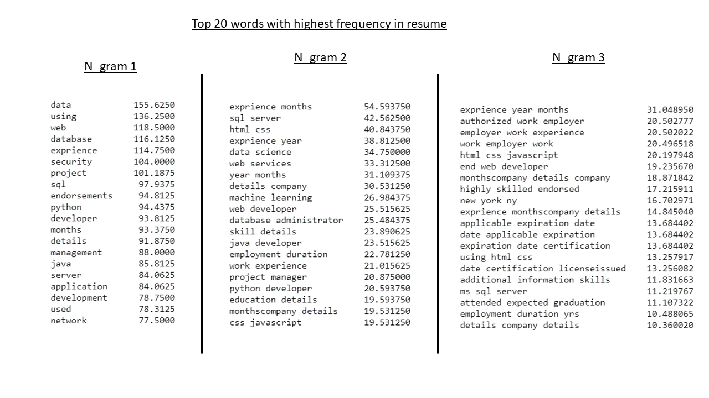

These are the top words using different n_grams on the resume dataset. The words were not simplified using either stemming or lemmatization because we would want the skills to be captured in their original wording else it would be tough to guess the lemmatized version of the skillset.
From the results we can observe that there are majority of words that is unrelated to skills, this is because we are extracting from the entire context of the resume plus we are only using the default stop words from sklearn. Therefore we can extend the stop words to include action verbs. A decision has been made to use n_gram(1,3) for the vectorization.

#### Topic Modeling visualization using pyLDAvis

##### TFIDF-Vectorizer (Topic 1)
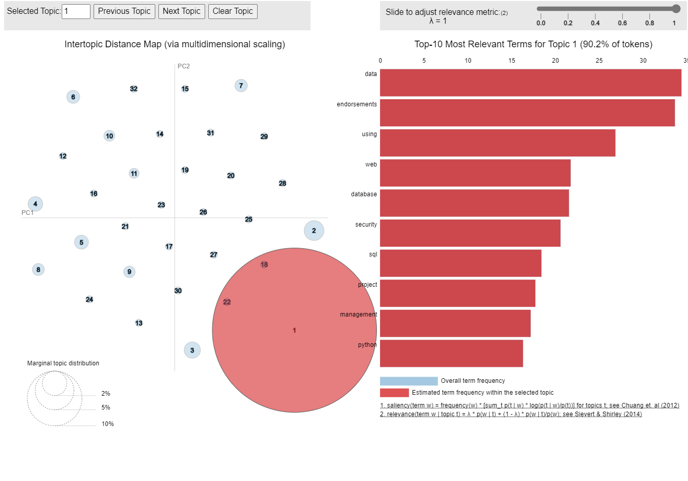

##### CountVectorizer (Topic 1)
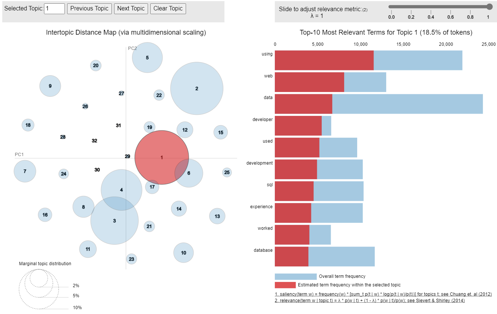

`pyLDAvis` was used to identify and cluster skillsets from resumes that fall under different job titles. Values of lambda that are very close to 0 will show terms that are more specific for a chosen topic. Meaning that you will see terms that are "important" for that specific topic but not necessarily "important" for the whole corpus.   Values of lambda that are very close to 1 will show those terms that have the highest ratio between frequency of the terms for that specific topic and the overall frequency of the terms from the corpus.

Countvectorizer definitely did better in clustering the words as compared to TFIDF as the topics are much better spread out and each topic are of equal circle size but still, the results were not easily interpretable.  

For instance we can see the results for topic 1 of TFIDF-Vectorizer, which is the largest circle as it represents 90.2% of the entire tokenized words is probably categorized as a web developer related with keywords like SQL, web, developer, python, database etc. Similarly for CountVectorizer of topic 1, it is clustered as a web developer with the similar keywords like web, SQL, developer as well.  

##### TFIDF-Vectorizer (Topic 7)
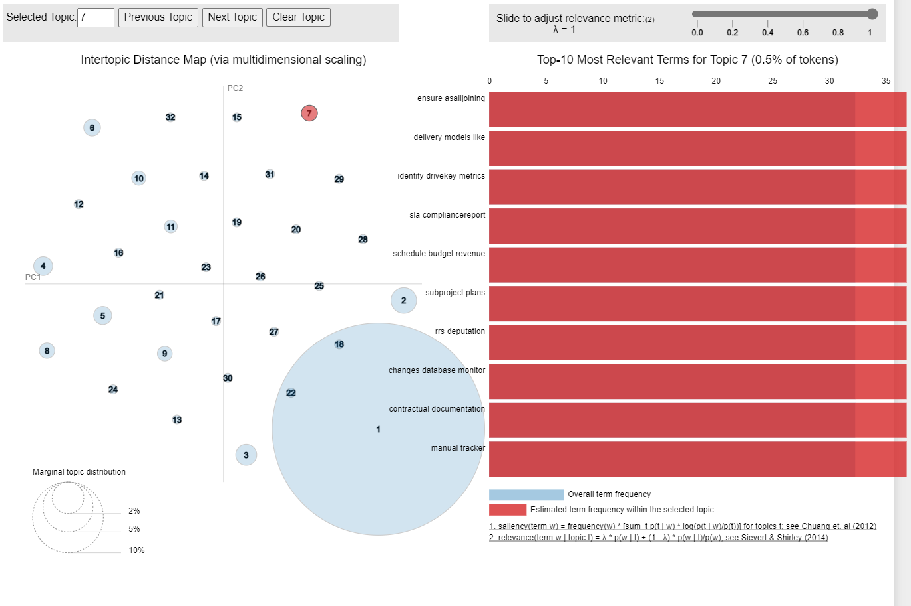

##### CountVectorizer (Topic 7)
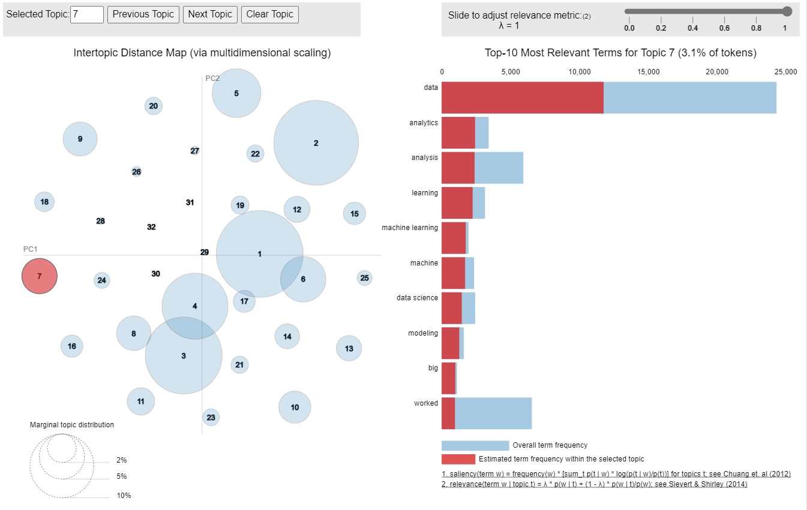

However if were to compare topic 7, we can clearly identify that topic 7 is clustered as a data scientist related job using CountVectorizer but for TFIDF-Vectorizer it is difficult to deduce anything from it.  I have decided to leave topic modeling as part of EDA due to the inability to categorize my dataset.

## Recommendation System

Here is a run-through on how the function works.  Users are given an option to select skill set based on either:

1. Job requirements (inputting no_of_skills as 0)
2. Top skills identified during EDA (inputting no_of_skills anything above 0, only use if job skills from post are insufficient)

On top of that, there is a mandatory input field "job_post_id" which represents the id of the job post for the recommender to return recommended applicant. Users are also able to specify the number of candidates under the variable, "no_of_candidate" which defaults at 10 and required skills as a list under the variable, "req_skills".

In summary, there are 4 inputs to the function:
1. job_post_id
2. no_of_skills
3. no_of_candidate
4. req_skills

Based on the method of identifying the skills, the resume will be filtered and a matrix multiplication will be done between the filtered job_post and resume dataset returning a matrix which consist of all the scores between jobs and resumes.
From there, the function will check if there is any required skills mentioned and if there is, a rule will be set to filter out any applicant with 0 in their profile for any of the mentioned skills. The remaining applicant will then be sorted in descending order and filter to display the number of candidates requested by the user. Finally, the function will concatenate the total score and scores of applicant skills in a dataframe.  However, the scores of the applicant skills are only a true representation to the total score if the skills listed are from the job post itself as by using the skillsets identified from EDA, users are unable to know what is the binary value of the skill listed in the job post.

There are also a feature where a timer was set at the start of the function to calculate the time taken to run. This is to compare with the time needed for the user to vet the resume, on the assumption that the user takes an average of 6 seconds to screen a resume.

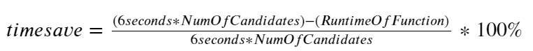

##### Using Top Skills Identified during EDA

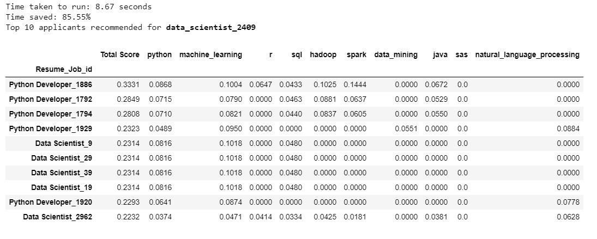

##### Using Top Skills Identified during EDA and established required skills from the list

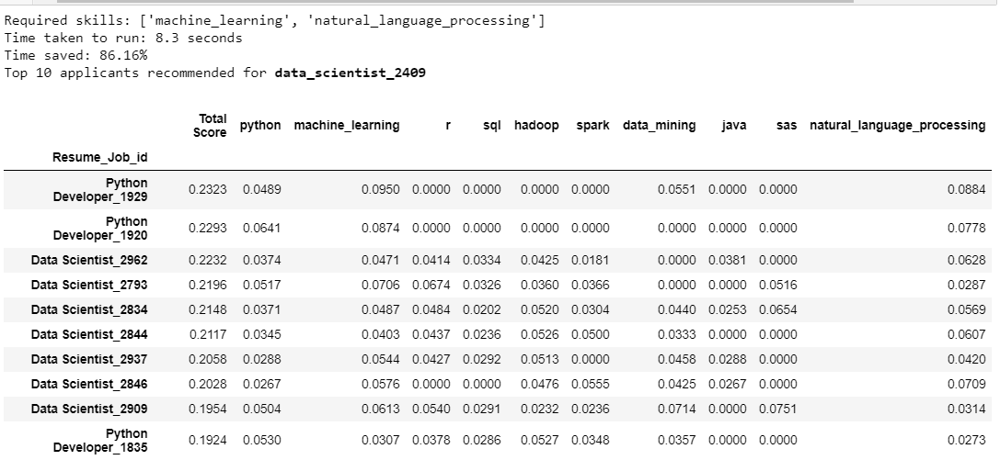

##### Using Skills mentioned in the job requirements

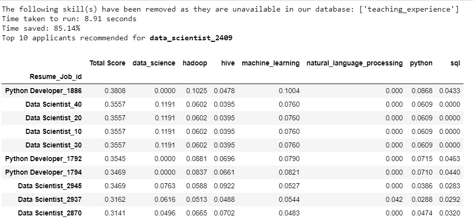

##### Using Skills mentioned in the job requirements and established required skills from the list

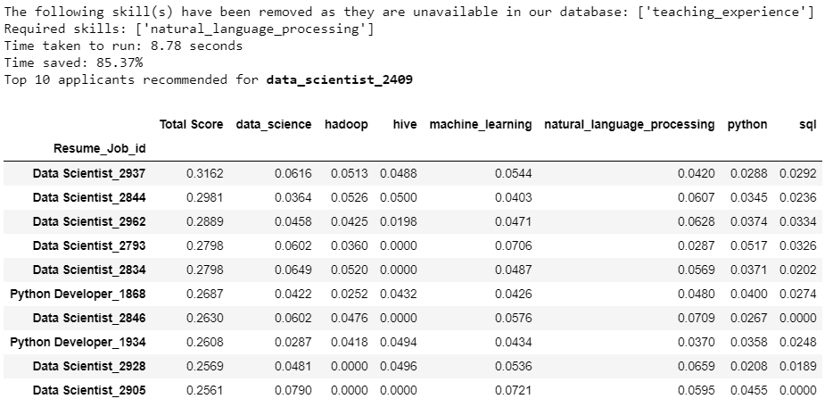

---

## Cost Benefit Analysis

Although we are unable to measure the benefit in monetary value, it can be replace with time. With the recommendation system, we are able to reduce the time to hire, this in turn can allow the company to better allocate more resources elsewhere. By hiring the right person for the job, this improves the quality of hire. This can be define as the total value the new employees offer to the company with their performance. Variables considered when calculating the quality of hire include ramp-up time, turnover rates, and performance reviews. Research suggests that high-quality, talented candidates stay in the market no more than 8-12 days. Thus, it is vital to speed up the hiring process to ensure you get the top candidates before other companies snatch them.

---

## Conclusion

Clearly, this is not a foolproof method because there is no clear distinction on whether the candidate is right or wrong for the job. The recommender will recommend applicants who fulfils the job requirements based on the skill set and grant them a chance for an interview but does not guarantee them landing a job because the recommender does not capture the aspect of soft skills.

However the recommender indeed help the user to save time like instead of screening hundreds of resumes and choose suitable candidates for interviews, it returns an overview of the applicants it recommended and it takes an average of 10-15 seconds to return an output saving approximately 80% for 10 candidates. It also provides the flexibility to allow user to customize and experiment on different requirements.

The recommender can be further improve with users feedback, A/B testing on the skillset option or on different industry and also would be best if we are able to capture more information on both job post & resumes so we can expand the recommendation based on the different level of the job (Entry or senior role), location etc. Something similar to like using an app to retrieve information as there is consistency of the data retrieved.

---
## Citations

1</sup1> "2021 HR Statistics: Job Search, Hiring, Recruiting & Interviews", Bart Turczynski, April 2021.   [Online] Available: https://zety.com/blog/hr-statistics [Accessed: May 11, 2021]
 
2 "2017 Recruiter Sentiment Study with insights from Employees and Candidates", The Martec Group, 2017   [Online] Available: https://mrinetwork.com/media/304094/2017hiringsentimentstudy.pdf [Accessed: May 11, 2021]
 
3 "Google interview process + interview questions", Kindra Cooper, July 2020.   [Online] Available: https://candor.co/articles/interview-prep/google-interview-process-interview-questions [Accessed: May. 9, 2021]
